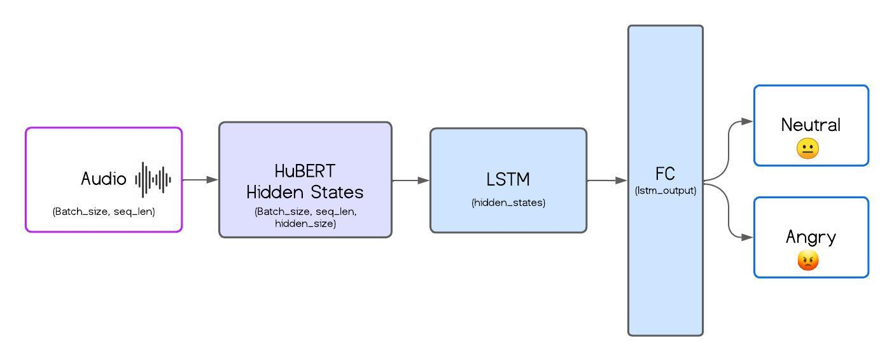

# Speech Emotion Recognition (SER)

This project implements a Speech Emotion Recognition (SER). The model classifies emotional states from voice signals and was trained on the ShEMO dataset, comprising 3,000 audio samples from 87 native Persian speakers.

The architecture leverages HuBERT, a pre-trained Transformer model for feature extraction, combined with LSTM layers for temporal modeling and fully connected layers for classification. This pipeline captures long-range dependencies in audio signals and incorporates dropout and pooling to improve robustness.

### Results
The system achieved 94% precision on binary classification (Angry vs. Neutral) after 10 epochs. These results highlight its potential for applications in virtual assistants, mental health monitoring, and call center analytics.

**Future Work**  
- Multi-class classification.  
- Advanced architectures like attention-based models or Bi-LSTMs.

### Requirements
- Python 3.8+
- PyTorch 2.0+
- Transformers library
- NumPy, Pandas, Matplotlib

